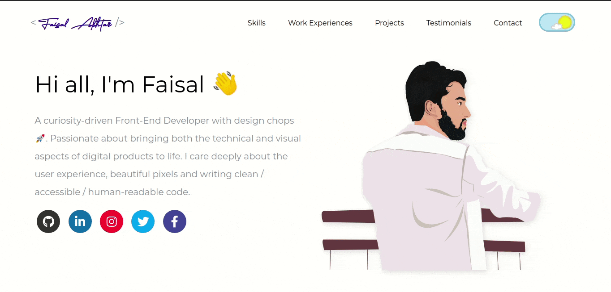

# My Dev Portfolio

&emsp;

<u>Switching between dark and light modes</u>

## Sections covered
- [x] Tools
- [x] Skills & Tools
- [x] Proficiency
- [x] Experiences
- [x] Projects
- [x] Big-projects
- [x] Testimonials
- [x] Reach out to me

Click [here](https://faisalakhtar.github.io/) to go to the portfolio.

## Techstack

### Illustrations

### Web Interface

### External Libraries
- Scrolling animation - [AOS](https://github.com/michalsnik/aos)

### Obfuscators
[HTML](http://snapbuilder.com/code_snippet_generator/obfuscate_html_source_code/), [CSS](http://cssobfuscator.com/), [JS](https://obfuscator.io/)

## Contributors

<table>
  <tr>
    <td align="center">
      <a href="http://faisalakhtar.github.io">
        
         
        <b>Faisal Akhtar</b>
      </a>
       
      <a title="Code">💻</a>
      <a title="Documentation">📖</a>
      <a title="Maintenance">🚧</a>
    </td>
    <td align="center">
      <a href="http://goyalshubhangi.github.io">
        
         
        <b>Shubhangi Goyal</b>
      </a>
       
      <a title="Design">🎨</a>
      <a title="Maintenance">🚧</a>
    </td>
  </tr>
</table>

## Licensing

All scripts, stylesheets and markups are distributed under the [MIT](LICENSE) license.

## Acknowledgements

- The toggle Button was inspired from [here](https://dribbble.com/shots/1909289-Day-Night-Toggle-Button-GIF?list=searches&tag=toggle&offset=8).

- Some implementation ideas are taken from [here](https://github.com/saadpasta/developerFolio).

- Some icons are imported from [here](https://cdnjs.cloudflare.com/ajax/libs/font-awesome/5.12.0-2/css/all.min.css)

- [This](img/faisal2.svg) illustration was drawn by [Shubhangi](https://goyalshubhangi.github.io/).
